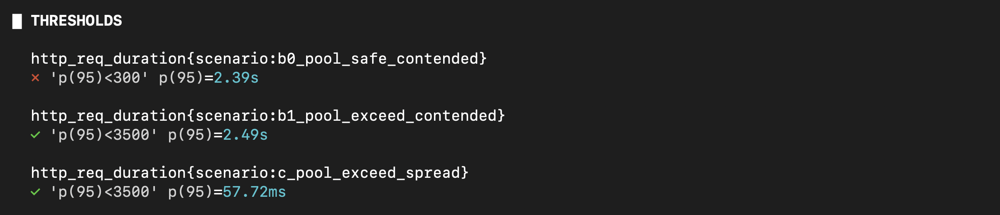
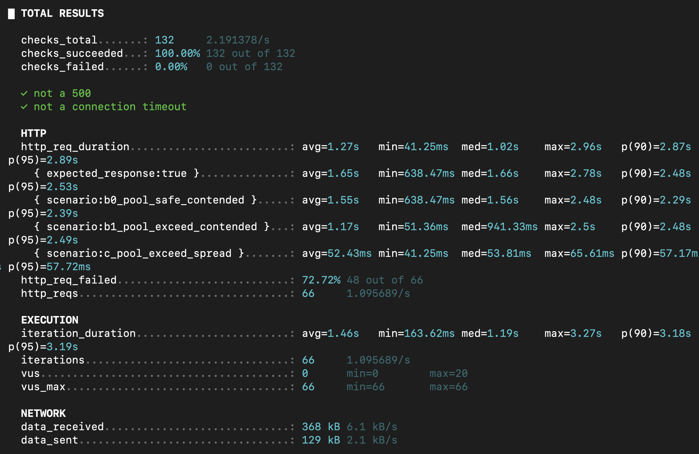

### 배경

[1차 실행](round1-findings.md)에서 66건 중 34건이 원인 미상의 500으로 실패했고, 서버 로그를
확보하지 못해 원인 미확인 상태로 남겼다. 이번 라운드는 같은 조건(`DEV_AUTH_ENABLED=true`
유지, `https://api.knu80th.shop` 대상)에서 재시드 후 재실행한 기록이다.

---

### 실행

1차와 동일한 절차. `DEV_AUTH_ENABLED` override가 여전히 살아있는지부터 확인:

```bash
kubectl get deployment travelx-server -o jsonpath='{.spec.template.spec.containers[0].env}'; echo
# [{"name":"DEV_AUTH_ENABLED","value":"true"}]  — 1차 이후 원복 안 하고 계속 켜진 채였음
```

토큰 유효기간(30분)이 지나 `seed.sh` 재실행 → 새 `branchId=21`로 시드 완료 후 k6 실행.

---

### 결과 — 500은 재현 안 됨, 그런데 성공 건수가 예상보다 훨씬 적음




```
checks_total: 132, checks_succeeded: 100% (132/132)
  - "not a 500": 66/66 통과 (1차: 34/66 실패 → 이번엔 0건, 재현 안 됨)
  - "not a connection timeout": 66/66 통과
http_req_failed (2xx/3xx가 아닌 응답): 72.72% (48/66)

http_req_duration:
  - b0_pool_safe_contended (VU=6, 풀 이내):   avg 1.55s  p95 2.39s  → 임계치(p95<300ms) 실패
  - b1_pool_exceed_contended (VU=20, 풀 초과): avg 1.17s  p95 2.49s  → 임계치(p95<3500ms) 통과
  - c_pool_exceed_spread (VU=20, 분산 슬롯):   avg 52ms   p95 57.7ms → 임계치(p95<3500ms) 통과
```

**좋은 소식**: 1차의 500(34건)이 이번엔 하나도 재현되지 않았다 — 그리고 이번엔 원인도
확인됐다(아래 "1차 500의 실제 원인" 참고). 우연이나 워밍업 효과가 아니라 그 사이 서버 팀이
실제로 버그를 고쳐서 배포했기 때문이었다.

**남은 의문**: `http_req_failed` 48건 = 정상적인 정원초과 4xx 거절일 텐데, 66-48=18건만
성공(2xx)이다. A(20명 중 6명)+B1(20명 중 6명)만 정원 때문에 거절되는 게 이론상 정상이라면
기대 성공 건수는 6(A)+6(B0, VU=6=정원과 정확히 일치)+6(B1)+20(C, 무경합)=**38건**인데 실제는
**18건**뿐이다 — B0 또는 C(혹은 둘 다)에서 예상보다 훨씬 많이 거절되고 있다는 뜻이다.

---

### 1차 500의 실제 원인 — `server` 레포 `develop`에서 확인됨

로컬 `server` 레포 클론이 `origin/develop`보다 뒤처져 있었다(`git fetch`로 확인). 1차 실행
이후 서버 팀이 아래 커밋을 `develop`에 직접 푸시했고, 실서버가 그 이미지로 재배포되면서
2차 실행 시점엔 이미 반영돼 있었던 것으로 보인다(우리가 재배포를 트리거한 적은 없다).

**`ca4867f fix: reservation table bug 해결`** — `V16__restore_branch_time_slots_unique_constraint.sql`:

`branch_time_slots` 테이블에 V8에서 걸었어야 할 UNIQUE 제약
(`branch_id, slot_date, slot_time`)이 **실제 운영 DB엔 없는 스키마 드리프트** 상태였다
(V13이 빈 파일이라 컬럼이 안 생겼던 것과 같은 종류의 문제). 그런데
[`BranchTimeSlotRepository`](https://github.com/vietnam-internship/server/blob/develop/src/main/java/com/fptis/intern/server/domain/branch/BranchTimeSlotRepository.java)의
`ensureExists()`(`INSERT ... ON DUPLICATE KEY UPDATE`)는 이 제약이 있어야만 "행이 없으면 동시에
두 트랜잭션이 각자 INSERT를 시도"하는 경쟁을 DB 레벨에서 막을 수 있다고 자체 주석에 명시돼
있다. 제약이 없으니:

1. 시나리오 A처럼 20명이 동시에 같은 (branch_id, date, time)으로 몰리면, `ensureExists()`의
   `ON DUPLICATE KEY UPDATE`가 걸릴 게 없어 **여러 요청이 각자 성공적으로 INSERT** → 같은
   슬롯에 중복 행이 쌓임
2. 뒤이은 `lockForUpdate()`는 `Optional<BranchTimeSlot>` 단건을 기대하는 JPQL인데, 중복 행이
   있으면 다건이 반환되어 `IncorrectResultSizeDataAccessException` 같은 예외가 터짐
3. 이건 `BusinessException`이 아니라서 `GlobalExceptionHandler`의 제네릭 `Exception` 캐치로
   빠져 **500(C009)**으로 응답됨

**즉 1차의 500 34건은 우리 부하테스트(시나리오 A의 고동시성)가 아니면 드러나지 않았을 실제
동시성 버그였다** — discussion#13이 원래 검증하려던 "락 설계가 실제로 동작하는가"라는 질문에
정확히 들어맞는 발견이다. 같이 온 `338f517 refactor: 예외 처리 고도화`(`GlobalExceptionHandler`
확장)도 관련 있어 보이나 이번 라운드 분석에 직접 쓰진 않았다.

---

### 사후 재구성 시도 — 서버 상태로는 정확한 건수를 못 되짚는다는 걸 확인

k6 콘솔에는 시나리오별 성공/실패 분포가 안 나와서, 관리자 API로 사후에 재구성해보려 했다.

1. `GET /admin/branches/21/reservations?status=ALL` → **0건**. 원인:
   `AdminReservationService.resolveStatuses("ALL")`이 반환하는 목록에
   **`PENDING_PAYMENT`가 빠져 있다** (`RESERVED, COMPLETED, CANCELLED, EXPIRED`만 포함).
   부하테스트 예약은 실제 Stripe 결제를 안 태우므로 전부 `PENDING_PAYMENT`로 남는데, 이 상태는
   `ALL`/`CANCELLED` 필터 어느 쪽으로도 조회가 안 된다 — 그렇다고 필터에 지정 가능한 다른 값도
   없다(`PENDING`은 `RESERVED`만 가리킴). 즉 **이 관리자 API로는 결제 전 홀드 상태의 예약을
   조회할 방법이 아예 없다.**
2. `GET /admin/branches/21/inventory` → USD 재고 999,700 (1,000,000 - 300, 순수 3건분).
   그런데 5분 TTL이 지나면 `expireOverduePendingPayments()`가 재고를 복원하므로, 조회 시점에
   따라 이미 일부가 복원된 뒤일 수 있어 이 숫자도 "그 순간 성공한 총 건수"를 보장하지 않는다.

**결론**: 서버 쪽 사후 조회로는 시점 경합(TTL) 때문에 정확한 성공 건수를 재구성할 수 없다.
→ k6 스크립트 자체가 각 요청의 결과를 바로 로그로 남기도록 고치는 게 맞다.

---

### 조치: `k6/scenario.js`에 결과 로그 추가

`reserve()` 마지막에 아래 로그를 추가했다 (서버 상태 경합과 무관하게 그 자리에서 바로
시나리오별 분포를 확인하기 위함, 실패 시 응답의 `code`(BusinessErrorCode)도 같이 남겨
"정상 거절"과 "처리 안 된 예외"를 바로 구분할 수 있게 함):

```js
console.log(`RESULT scenario=${scenarioName} vu=${__VU} status=${res.status} code=${errorCode}`);
```

다음 실행부터는 아래처럼 stdout을 파일로 받아서 바로 분포를 집계할 수 있다:

```bash
k6 run -e BASE_URL=https://api.knu80th.shop k6/scenario.js \
  --summary-export=results/summary.json 2>&1 | tee results/round3-raw.log

grep RESULT results/round3-raw.log | awk -F'[= ]' '{print $3, $7}' | sort | uniq -c
# 시나리오별 status 분포가 바로 집계됨
```

---

### 남은 것 (다음 세션)

- [x] 1차 500의 원인 확인 — `ca4867f`(V16, `branch_time_slots` UNIQUE 제약 복구)로 해결됨.
      로컬 `server` 클론이 뒤처져 있었으니 계속 `git fetch`로 `origin/develop`을 확인할 것
- [ ] 위 로그를 켠 채로 재실행 → 시나리오별 실제 성공/실패 분포 확인, B0/C가 왜 기대치(38건)보다
      훨씬 적게 성공(18건)하는지 원인 규명
- [x] `createReservation()`의 Stripe 호출이 슬롯 락 보유 구간(같은 `@Transactional` 메서드) 안에
      있는 것은 코드로 확인 완료 — `ReservationService.createReservation()`이 `reservationHoldService
      .createHold()`(락 획득) 직후 같은 트랜잭션에서 바로 `paymentService.createPaymentIntent()`
      (Stripe 외부 호출)를 부른다. b0의 p95가 1차(825ms) → 2차(2.39s)로 나빠진 것도 이 구조와
      무관하지 않아 보임. **고칠지 여부는 아직 미결정** — 락을 짧게 쓰도록(예: 홀드 커밋 후 Stripe
      호출을 별도 트랜잭션으로 분리) 서버 레포 쪽에서 논의 필요
- [ ] 정리 필요: 테스트 지점 `branchId=40`(1차, 중단됨), `41`(1차, 실행분), `21`(2차, 실행분) 총 3개
- [ ] `DEV_AUTH_ENABLED=false`로 원복 (1차부터 지금까지 계속 `true`로 켜진 채 방치됨 — 다음
      세션에서 최종 테스트 끝나면 반드시 끌 것)
