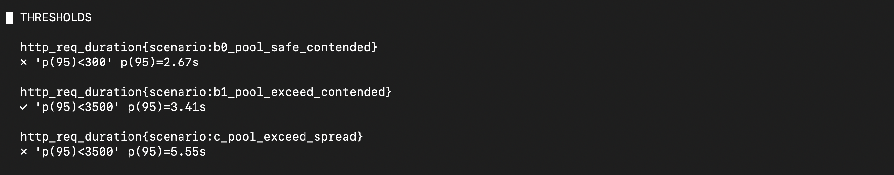
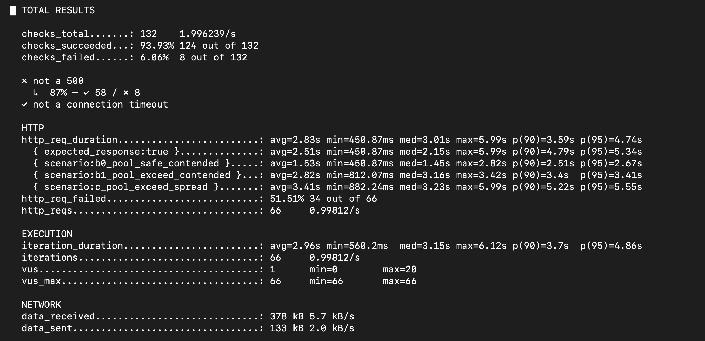

### 배경

[4차](round4-findings.md)에서 `k6`의 `__VU` 전역 넘버링 버그를 고쳤다. 이번 라운드는 그 수정
후 처음으로 제대로(끝까지 중단 없이, 재시드 후) 돌린 실행이고, 여기서 **원래 discussion#13이
검증하려던 질문("락이 병목인가, 커넥션 풀이 병목인가")에 대한 실제 답**을 얻었다.

---

### 실행 및 결과 — `__VU` 픽스 확인, 정합성 통과

```bash
BASE_URL=https://api.knu80th.shop ./scripts/seed.sh
k6 run -e BASE_URL=https://api.knu80th.shop k6/scenario.js \
  --summary-export=results/summary.json 2>&1 | tee results/round5-raw.log
```

`BUG scenario=... out of range` 로그 0건 — 4차의 `__VU` 픽스가 정상 동작함을 확인.




```
A:  6×201(성공) + 14×409 C206(정원초과)                  = 20  ✅ 정확히 6건 성공(정합성 통과)
B0: 6×201(성공)                                          = 6   ✅ 6/6 전부 성공
B1: 6×201(성공) + 12×409 C206 + 2×500 C009               = 20  ✅ 정원 로직 정상, 500 2건
C:  14×201(성공) + 6×500 C009                            = 20  ⚠️ 경합 없는 대조군인데 500 6건
```

총 성공 32/38(이론값) — `__VU` 버그로 가려져 있던 예전 라운드들보다 훨씬 이론값에 가까워졌다.

---

### 잔여 500(C009)의 정체 — HikariCP 커넥션 풀 고갈

이번엔 처음으로 실행 직후 곧바로 서버 로그를 확보했다. 새로 pull한
`GlobalExceptionHandler`(커밋 `338f517`)가 제네릭 예외를 `"Unhandled exception"`으로
ERROR 로깅하도록 바뀐 덕분에 바로 스택트레이스를 찾을 수 있었다:

```
org.springframework.transaction.CannotCreateTransactionException: Could not open JPA EntityManager for transaction
    at org.springframework.orm.jpa.JpaTransactionManager.doBegin(...)
    ...
    at com.fptis.intern.server.application.reservation.ReservationService$$SpringCGLIB$$0.createReservation(<generated>)
    at com.fptis.intern.server.presentation.reservation.ReservationController.createReservation(...)
```

`HIKARI_CONNECTION_TIMEOUT=3000ms` 안에 풀(`HIKARI_MAX_POOL_SIZE=8`)에서 커넥션을 못 받으면
나는 예외 그대로다. **B1(2건)/C(6건) 둘 다 VU=20으로 풀 크기(8)를 초과하는 시나리오**에서만
발생했고, 풀 이내인 B0(VU=6)에서는 0건이었다 — 커넥션 풀이 원인이라는 가설과 정확히 들어맞는다.

**흥미로운 비대칭**: 락 경합이 있는 A(정원 6, VU=20)는 이 에러가 0건인데, 락 경합이 전혀
없는 C(분산 슬롯, VU=20)는 오히려 6건(30%)으로 더 많다. 슬롯 락이 요청들을 순차적으로 줄
세우는 효과가 있어서 동시 DB 커넥션 수요를 오히려 분산시키는 반면, C는 경합이 없으니 20개
요청이 그대로 동시에 DB로 몰려 풀이 더 확실하게 고갈되는 것으로 보인다 — **락이 병목이
아니라 오히려 완충 역할을 하고, 진짜 병목은 커넥션 풀**이라는 걸 시사한다.

---

### 핵심 질문(discussion#13)에 대한 잠정 답

> 슬롯 정원 경합 상황에서, 락 자체가 병목인가 아니면 커넥션 풀이 먼저 병목이 되는가?

**이번 라운드 데이터로는 커넥션 풀 쪽이다.** 락 자체는(A/B0/B1 모두) 정합성을 정확히
지켰고, 락으로 인한 추가 500은 관측되지 않았다. 반면 VU가 풀 크기(8)를 초과하는 모든
시나리오(B1, C)에서 `CannotCreateTransactionException`이 발생했고, 락 경합이 없는 C가
오히려 더 많이 겪었다. `HIKARI_MAX_POOL_SIZE=8`이 실제 동시 부하 앞에서 raw 500을 내는
지점이라는 것이 이번 라운드의 결론이다.

**서버 레포 쪽에 제안할 만한 개선 방향** (이 레포의 스코프 밖이라 실행은 안 함):
- `CannotCreateTransactionException`/`SQLTransientConnectionException`을 500 대신
  503(Service Unavailable) 등 명확한 재시도 유도 응답으로 처리
- `HIKARI_MAX_POOL_SIZE`를 실제 기대 동시 부하에 맞게 재산정할지 검토

---

### 남은 것

- [ ] 정리 필요: 테스트 지점 `branchId=40,41`(1차), `21`(2차), `22`(3차), `23`(중단된 4차 시도),
      `24`(5차) 총 6개 — 전부 `scripts/cleanup.sh` + 수동 SQL로 정리
- [ ] `DEV_AUTH_ENABLED=false`로 원복 (계속 `true`로 켜진 채 방치됨 — 테스트 마무리되면 필수)
- [ ] (선택) 위 서버 개선 제안을 실제로 반영할지는 서버 팀과 별도 논의
